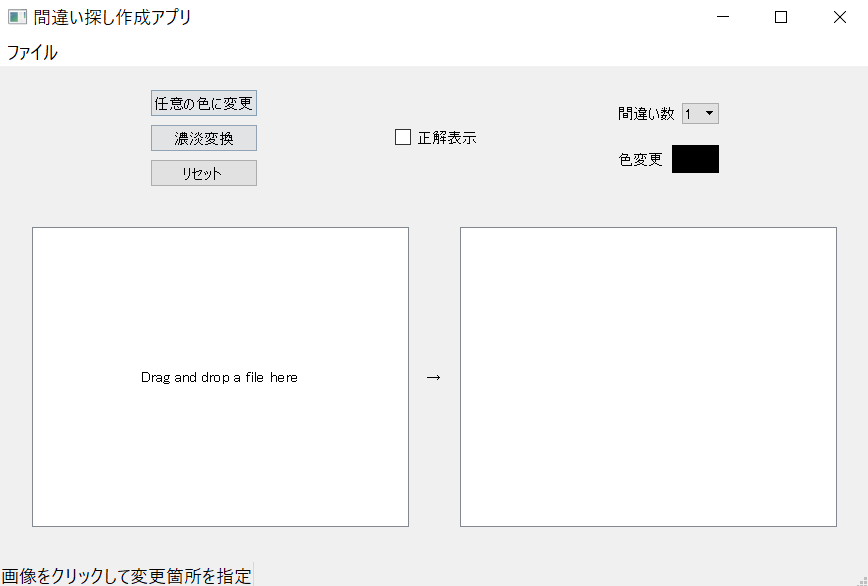
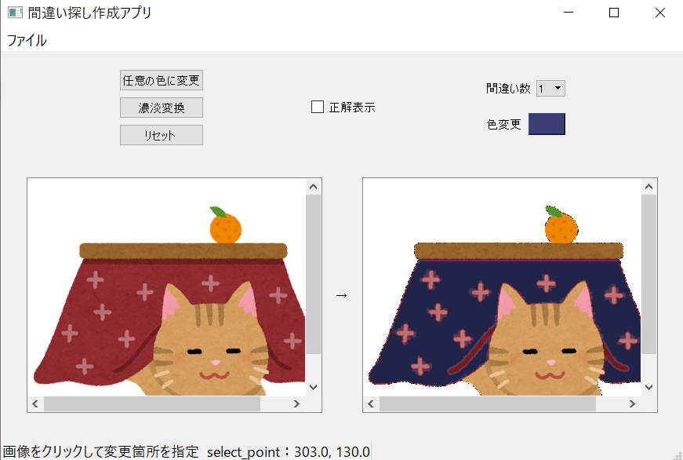

# color-conversion-app
2021年12月～2022年1月に授業課題でチーム開発した色変換アプリ（間違い探し作成アプリ）です。
当初の予定では間違い探し作成アプリというテーマで進めていましたが、色変更の実装までに留まりました。

## 概要
入力した画像の一部を別の色で塗りつぶすことができる。

[スライド(Google drive)](https://drive.google.com/file/d/1KtU3N0gb22Lsgl9MHaepyVDoutHpd4dI/view?usp=sharing)

[詳細資料(Google drive)](https://drive.google.com/file/d/1pHyGHyJai6rglXZUvV5s1yqhdzYXATQe/view?usp=sharing)

## 機能
実装済みの機能は以下のとおりである。間違い数と正解表示機能については実装できなかった。
### 1. ファイルメニュー
- 開く…元となる画像を選択するためにファイルを開く
- 保存…変換後の画像を保存する

### 2. 元画像入力＆表示エリア
選択した画像ファイルを表示する領域。「Drag and drop a file here」と書いてあるよう
に、画像ファイルをドラッグ＆ドロップすることでも表示できる。

### 3. 変換後画像表示エリア
任意の色に変更または濃淡変更ボタンを押した後、変換後画像が表示される。

### 4. ステータスバー
元画像領域の特定位置をクリックすると、その位置の座標を取得し表示する。

### 5. 任意の色に変更
クリックして取得した座標位置を含む領域の色を変更する。色は、[色変更] ボタンをク
リックすると色選択ウィンドウが立ち上がるので、そこで選択する。

### 6. 濃淡変換
クリックして取得した座標位置を含む領域の色を一段階濃くする。

### 7. リセット
画像表示エリアの画像を消して，起動後の状態に戻す．

## 実行例

### 実行前

### 実行後

## 工夫点
1. 画像クリックで色変更箇所を自由に指定できる
2. ドラッグ＆ドロップとファイルメニューの2 つの方法で画像ファイルを開ける
3. 変更後の画像を名前を付けて好きな場所に保存できる
4. 様々なエラーに対応してWarning 表示が出る．
  - 元画像を指定せず実行したとき
  - 画像のどの位置もクリックせずに実行したとき(変更位置の座標を取得していない
とき)
  - 画像ファイル以外のファイルを選んだとき

## 変更履歴
* 2023/05/10 リポジトリ作成
* 2023/05/15 詳細資料追加
